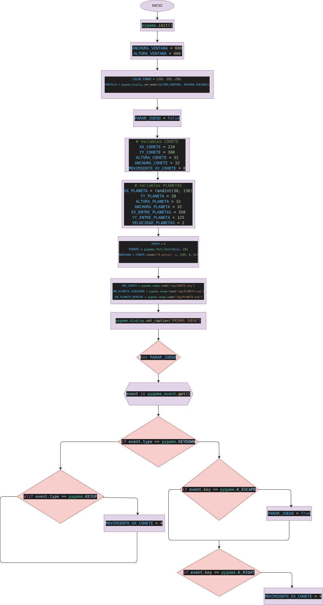

# bimestral_1

Este es un juego simple desarrollado con Python y Pygame, en el que el jugador o usuario controla un cohete que debe esquivar planetas mientras suma puntos.

## Explicación del Código

## Processing

### Primero importamos los modulos, que son :

- Se importa pygame para la creación del juego.

- Se importa randint para generar posiciones aleatorias de los planetas.

### Despues se inicia Pygame para poder utilizar sus funciones ( pygame.init() ).

### Se le ponen las variables a la ventana :
  - ANCHURA_VENTANA = 600
  - ALTURA_VENTANA = 600

  - COLOR_FONDO = (255, 255, 250)
  - PANTALLA = pygame.display.set_mode((ALTURA_VENTANA, ANCHURA_VENTANA))

  - La ventana del juego se crea con pygame.display.set_mode().

### Se hace un bucle para el juego y se define una variable booleana que va a controlar el bucle del juego.

  - # buleano de gestión del bucle
  - PARAR_JUEGO = False

### Variables del cohete

Se establecen las coordenadas y dimensiones del cohete.

  -  XX_COHETE = 210
  - YY_COHETE = 300
  - ALTURA_COHETE = 32
  - ANCHURA_COHETE = 32
  - MOVIMIENTO_XX_COHETE = 0 (controla su movimiento horizontal)

### Variables de los planetas

  - XX_PLANETA = randint(30, 130) : (Se define la posición inicial de los planetas.)
  - YY_PLANETA = 20 : (Se define la posición inicial de los planetas.)
  - ALTURA_PLANETA = 32 : (Se define su tamaño)
  - ANCHURA_PLANETA = 32 : (Se define su tamaño)
  - XX_ENTRE_PLANETAS = 350 : (Se establece la distancia entre los planetas izquierdo y derecho)
  - YY_ENTRE_PLANETA = 125 : (Se establece la distancia entre los planetas izquierdo y derecho)
  - VELOCIDAD_PLANETAS = 2 : (controla su velocidad para bajar)

### Puntos y otros

  - PUNTOS = 0 : (El contador de puntos se inicia en 0)
  - FUENTE = pygame.font.Font(None, 24) : (Se establece la fuente del texto de la puntuación)
  - MARCADOR = FUENTE.render("0 puntos", 1, (255, 0, 0)) : ( es la visualización del puntaje en pantalla)

### Images

  IMG_COHETE = pygame.image.load("img/COHETE.png")
  IMG_PLANETA_IZQUIERDO = pygame.image.load("img/PLANETA.png")
  IMG_PLANETA_DERECHO = pygame.image.load("img/PLANETA.png")  

- Se cargan las imágenes del cohete y los planetas.

### Nombre de la ventana

  pygame.display.set_caption("PRIMER JUEGO")

  - Se determina el nombre de la ventana.

### Bucle principal del juego

  while not PARAR_JUEGO
  - Mientras PARAR_JUEGO sea False, el juego continuará ejecutándose

### Se recorren los eventos del juego (teclas presionadas, salida, etc.)

  for event in pygame.event.get()

### Detecta cuando una tecla se presiona
 if event.type == pygame.KEYDOWN

### Para cerrar el juego

  if event.key == pygame.K_ESCAPE:
  PARAR_JUEGO = True
  - Si se presiona la tecla escape el juego se cierra

### Movimientos

  - ### Si se presiona la flecha derecha, el cohete se mueve a la derecha
  if event.key == pygame.K_RIGHT:
  MOVIMIENTO_XX_COHETE = 4

  - ### Cuando se suelta la tecla, el cohete se mueve en dirección contraria
  elif event.type == pygame.KEYUP:
  MOVIMIENTO_XX_COHETE = -4

### Si el cohete sale de los límites de la pantalla, el juego termina

   if XX_COHETE < -10 or XX_COHETE > ALTURA_VENTANA:
   PARAR_JUEGO = True

### Se rellena la pantalla con el color de fondo

   PANTALLA.fill(COLOR_FONDO)

### Se dibujan los planetas en la pantalla.

   PANTALLA.blit(IMG_PLANETA_IZQUIERDO, (XX_PLANETA, YY_PLANETA))
   PANTALLA.blit(IMG_PLANETA_DERECHO, (XX_PLANETA + XX_ENTRE_PLANETAS, YY_PLANETA + YY_ENTRE_PLANETA))

### Movimiento de los Planetas

   YY_PLANETA = YY_PLANETA + VELOCIDAD_PLANETAS
   - Se mueven hacia abajo

### Si los planetas salen de la pantalla, se reposicionan aleatoriamente y se incrementa la puntuación.

   if YY_PLANETA > ANCHURA_VENTANA:
   XX_PLANETA = randint(55, 150)
   YY_PLANETA = 25
   PUNTOS = PUNTOS + 1
   MARCADOR = FUENTE.render(str(PUNTOS) + " puntos", 1, (255, 0, 0))

### Si el cohete choca con el planeta izquierdo , el juego termina:
  
   PUNTO_INFERIOR_DERECHO_PRIMER_PLANETA_X = XX_PLANETA + ALTURA_PLANETA
    PUNTO_INFERIOR_DERECHO_PRIMER_PLANETA_Y = YY_PLANETA + ANCHURA_PLANETA

    if PUNTO_INFERIOR_DERECHO_PRIMER_PLANETA_X > XX_COHETE:
        if PUNTO_INFERIOR_DERECHO_PRIMER_PLANETA_Y > YY_COHETE:
            if PUNTO_INFERIOR_DERECHO_PRIMER_PLANETA_Y < YY_COHETE + ANCHURA_COHETE:
                PARAR_JUEGO = True

### Si el cohete choca con el planeta derecho, el juego termina:

   PUNTO_INFERIOR_IZQUIERDO_SEGUNDO_PLANETA_X = XX_PLANETA + XX_ENTRE_PLANETAS
    PUNTO_INFERIOR_IZQUIERDO_SEGUNDO_PLANETA_Y = YY_PLANETA + \
        YY_ENTRE_PLANETA + ANCHURA_PLANETA

    if XX_COHETE + ALTURA_COHETE > PUNTO_INFERIOR_IZQUIERDO_SEGUNDO_PLANETA_X:
        if XX_COHETE < PUNTO_INFERIOR_IZQUIERDO_SEGUNDO_PLANETA_Y:
            if XX_COHETE + ANCHURA_COHETE > PUNTO_INFERIOR_IZQUIERDO_SEGUNDO_PLANETA_Y:
                PARAR_JUEGO = True

### Movimiento del cohete

   XX_COHETE = XX_COHETE + MOVIMIENTO_XX_COHETE

### Se muestra la puntuación y el cohete en la pantalla y se Se actualiza la pantalla para reflejar los cambios

  PANTALLA.blit(MARCADOR, (20, 580))
    PANTALLA.blit(IMG_COHETE, (XX_COHETE, YY_COHETE))
    pygame.display.update()

# Diseño

# Construccion